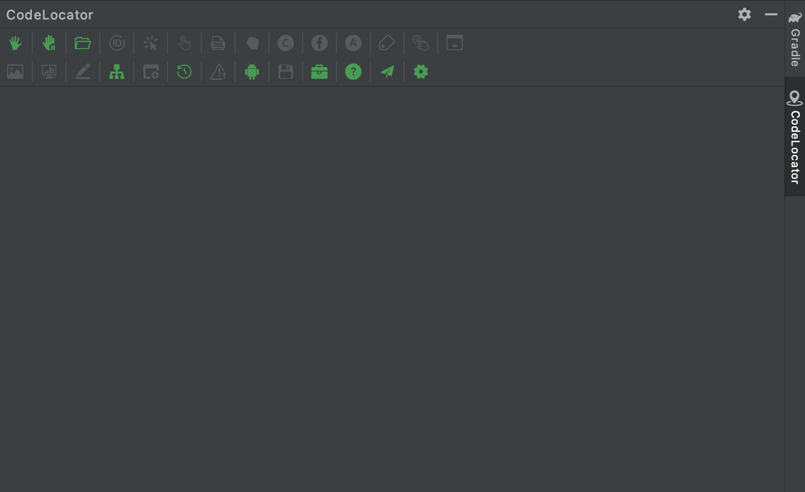
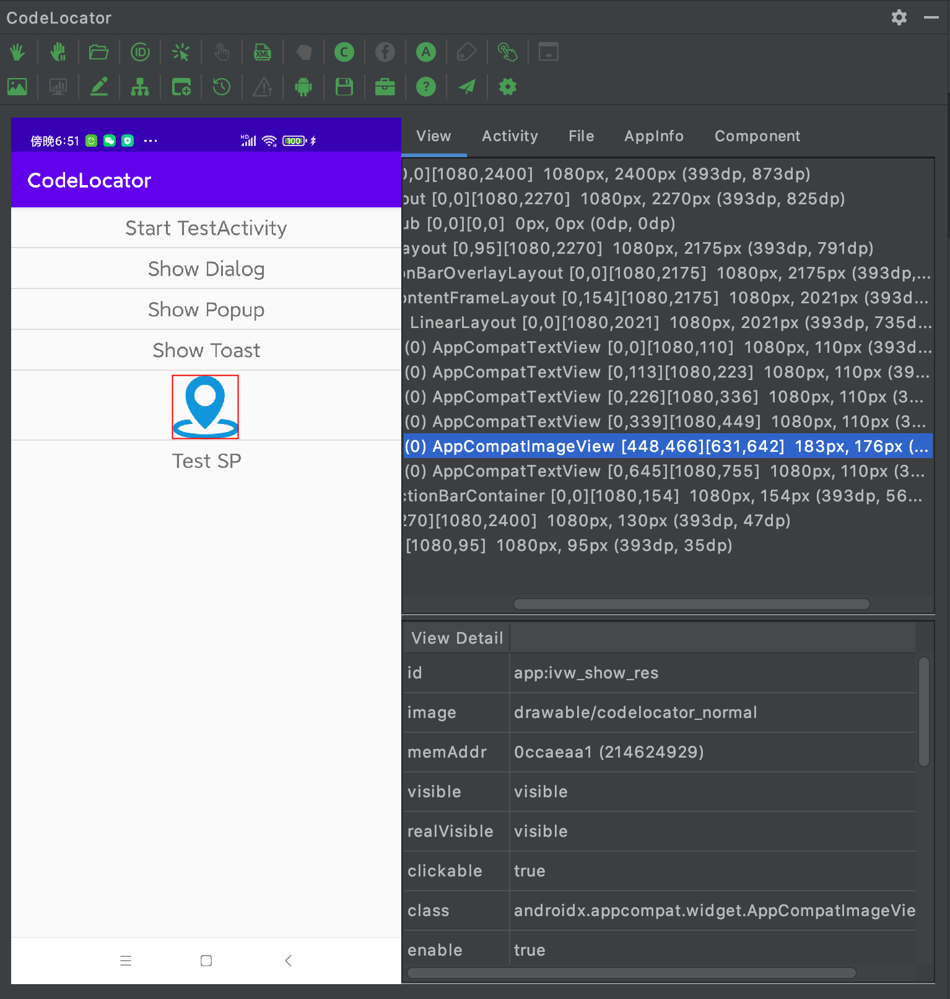

**[English](README_en.md)** | 简体中文

# CodeLocator
[](https://github.com/bytedance/scene/blob/master/LICENSE) 
[](https://developer.android.com/about/dashboards)

一张图带你了解CodeLocator  


CodeLocator是一个包含Android SDK 与 Android Studio插件的Android工具集, 包含如下的功能(目前仅支持Mac, Windows)：

1. 展示当前的View视图
2. 展示当前的Activity信息
3. 展示当前所有Fragment的信息
4. 展示自定义的App运行时信息
5. 展示当前应用的文件信息
6. 实时编辑View的状态, 如可见性, 文本内容等
7. 定位当前响应触摸事件的View
8. 获取当前View绑定的数据
9. 获取当前View对应的绘制内容
10. 跳转View的点击事件代码, findViewById, ViewHolder的代码位置
11. 跳转View的xml布局文件
12. 跳转Toast, Dialog的显示代码位置
13. 跳转启动当前Activity的代码位置
14. 展示应用支持的所有Schema信息
15. 向应用发送指定Schema
16. 定位项目内最新的Apk文件
17. apk文件支持右键安装
18. 快速打开显示布局边界, 过渡绘制, 点按操作等
19. 快速连接Charles代理  

## 这些App正在使用 CodeLocator

|  |  |  |  |  |  
|:---------:|:-------:|:-------:|:-------:|:-------:|
| 抖音 | TikTok | 多闪 | Resso | 西瓜视频 |  

|  | | |  | |
|:---------:|:-------:|:-------:|:-------:|:-------:|
| Helo | 飞书 | 清北网校 | 番茄小说 | 轻颜相机 |

|  |  |  |  |  |
|:---------:|:-------:|:-------:|:-------:|:-------:|
| 抖音火山版 | 瓜瓜龙 | 剪映 | 番茄畅听 | 幸福里 |
 
## 集成说明
按照如下操作即可使用CodeLocator:

1. 在Android Studio中安装CodeLocator插件([点此下载最新版插件](https://github.com/bytedance/CodeLocator/releases)), 也可直接在插件商店搜索 CodeLocator
2. App中集成CodeLocator

```gradle
allprojects {
    repositories {
        mavenCentral()
    }
}

// 集成基础能力, 只需要添加一行依赖即可
dependencies {
    // 依赖androidx, 已升级AndroidX的项目集成下面的依赖
    implementation "com.bytedance.tools.codelocator:codelocator-core:2.0.0"
    // 未升级AndroidX的项目集成下面的依赖
    implementation "com.bytedance.tools.codelocator:codelocator-core-support:2.0.0"
}
```
如果需要集成代码跳转能力, 需要先集成 [Lancet](https://github.com/eleme/lancet), 同时添加如下依赖
```gradle
dependencies {
    // 两种依赖方式
    // 依赖lancet-all, 则包含所有lancet能力
    debugImplementation "com.bytedance.tools.codelocator:codelocator-lancet-all:2.0.0"

    // 分别依赖对应的lancet模块, 包含相对应的跳转能力
    debugImplementation "com.bytedance.tools.codelocator:codelocator-lancet-xml:2.0.0"
    debugImplementation "com.bytedance.tools.codelocator:codelocator-lancet-activity:2.0.0"
    debugImplementation "com.bytedance.tools.codelocator:codelocator-lancet-view:2.0.0"
    debugImplementation "com.bytedance.tools.codelocator:codelocator-lancet-toast:2.0.0"
    debugImplementation "com.bytedance.tools.codelocator:codelocator-lancet-dialog:2.0.0"
    debugImplementation "com.bytedance.tools.codelocator:codelocator-lancet-popup:2.0.0"
    
    // 如果未升级AndroidX, 可使用下方的依赖
    debugImplementation "com.bytedance.tools.codelocator:codelocator-lancet-support-all:2.0.0"

    debugImplementation "com.bytedance.tools.codelocator:codelocator-lancet-xml-support:2.0.0"
    debugImplementation "com.bytedance.tools.codelocator:codelocator-lancet-activity-support:2.0.0"
    debugImplementation "com.bytedance.tools.codelocator:codelocator-lancet-view-support:2.0.0"
    debugImplementation "com.bytedance.tools.codelocator:codelocator-lancet-toast-support:2.0.0"
    debugImplementation "com.bytedance.tools.codelocator:codelocator-lancet-dialog-support:2.0.0"
    debugImplementation "com.bytedance.tools.codelocator:codelocator-lancet-popup-support:2.0.0"
    
}
```

## 使用说明
CodeLocator插件是一个侧边栏插件, 安装后展示在Android Studio的右侧, 点击可展开
初始状态如下



绿色按钮表示可点击, 灰色表示当前不可操作

点击抓取按钮后, 可获得当前应用的状态信息, 左边的图片面板可点击选择对应的View, 按钮状态会根据当前选中的View做出相对应的变化




更多操作可查看文档 [CodeLocator使用说明](how_to_use_codelocator_zh.md)


## 联系我们

如果你有任何关于CodeLocator的问题或建议，可以加入到微信群与我们沟通交流。


除此之外，你也可以发邮件到邮箱：liujian.android@bytedance.com, 在邮件中详细描述你的问题。  
也欢迎投递简历~

## License
~~~
Copyright (c) 2021 ByteDance Inc

Licensed under the Apache License, Version 2.0 (the "License");
you may not use this file except in compliance with the License.
You may obtain a copy of the License at

   http://www.apache.org/licenses/LICENSE-2.0

Unless required by applicable law or agreed to in writing, software
distributed under the License is distributed on an "AS IS" BASIS,
WITHOUT WARRANTIES OR CONDITIONS OF ANY KIND, either express or implied.
See the License for the specific language governing permissions and
limitations under the License.
~~~

*** 
The following components are provided under an Apache 2.0 license.

1. lancet - For details, https://github.com/eleme/lancet

2. okhttp - For details, https://github.com/square/okhttp

3. gson - For details, https://github.com/google/gson