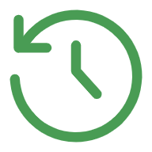
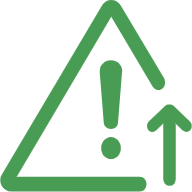
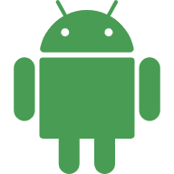
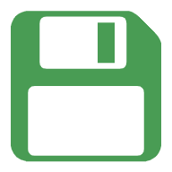
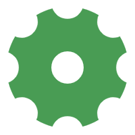
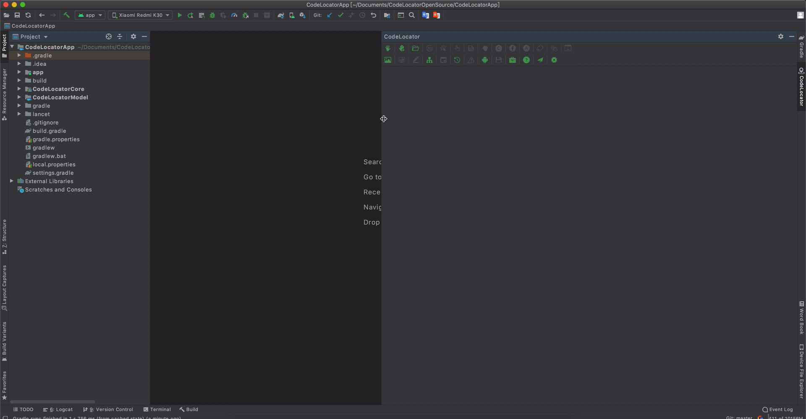
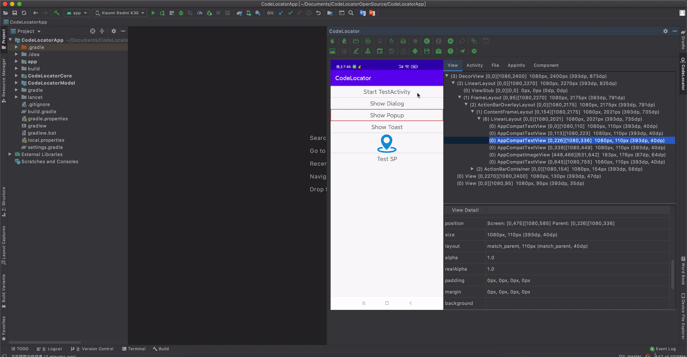
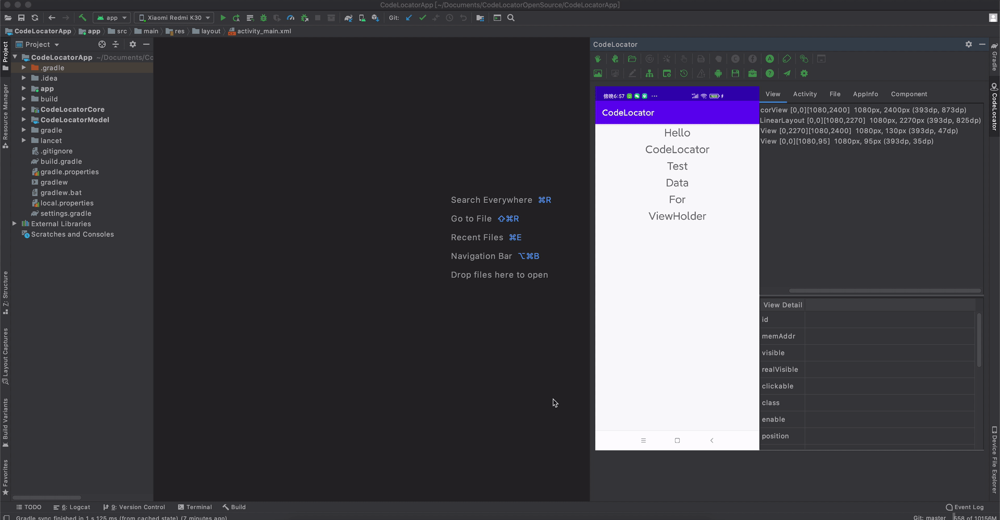
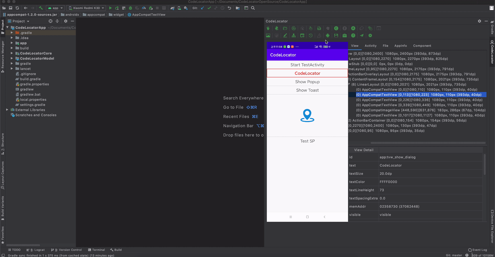

English | **[简体中文](how_to_use_codelocator_zh.md)**

# CodeLocator Instructions

## 1. Install Plugin
[Click here to download plugin](https://github.com/bytedance/CodeLocator/releases/download/1.2.1/CodeLocatorPlugin-1.2.1.zip)

Select Android Studio > Preferences > Plugins > Install Plugin from Disk

Select the downloaded Zip file to install

## 2. Interface instructions
CodeLocator is a sidebar plug-in that will be installed on the right side of Android Studio. Click Tab to expand the plug-in. The initial status is as follows

## 3. Function Instructions
CodeLocator can support 26 kinds of button operations currently. When the button is highlighted in green, it is clickable; while the button is in gray, it is not clickable. After hovering the mouse for a while, the specific function description will appear.

|  |  |  |  |  |  |  |  |  |  
|:---------:|:-------:|:-------:|:-------:|:-------:|:-------:|:-------:| :-------:| :-------:| 
| Grab | Pause & Grab | Load file | Jump to Find | Jump to Click | Jump to Touch | Jump to xml | Jump to Holder | Jump to Fragment |

|  |  |  |  |  |  |  |  |  |
|:---------:|:-------:|:-------:|:-------:|:-------:|:-------:|:-------:| :-------:| :-------:| 
| Jump to Activity | StartActivity | Click event tracking | Popup window tracking | Copy screenshot | Get View data | Edit View | Fixing dependencies | Open a new window |

|  |  |  |  |  |  |  |   |  
|:---------:|:-------:|:-------:|:-------:|:-------:|:-------:|:-------:| :-------:|
| Show grabbed history | Fix jump error | Install Apk | Save grabbed data | Tools box | Instructions | Feedback issue | Settings |

## 4. Usage

### Grab 
Make sure the application is in the foreground, and then click the crawl button to get the interface information

 This mode is direct grabbing

 This mode is to pause the animation and grab

### Select View
Click the image on the left to select View, or select the Item in the View Tree View on the right

Select View in the following modes:

Click: The View will be found according to the clickable properties, and the upper clickable View will overwrite the bottom View  
Alt + Click: It will look for the View that is currently clicked according to the View area, may cause click through problems  
Shift + Click: Select multiple views and compare the spacing of the last two views

### Code Jump
After selecting View, the corresponding jump code button will change according to the current information. Click the corresponding button to jump to the FindViewById, Xml, ViewHolder, Fragment and other code locations of the View

### Tab Switch
By default, there are four tabs: View, Activity, File, and AppInfo  
View Tab contains View tree browsing, and View details Table is at the bottom.  
Activity Tab contains Activity and Fragment tree, Fragment detail Table is at the bottom.
File Tab contains all files in the application directory
The AppInfo panel contains app runtime information. Click to copy automatically.
And support to add custom Tab.

### Tree display
Except AppInfo panel, the other panels are organized in the form of trees  

The display format of View Tree: [(number of subviews) [current View depth] (can be set to display) class name  top left vertex coordinates  bottom right vertex coordinates  width px height PX width dp height dp]  
The display format of Fragment Tree: [(Number of fragments) (* indicates that the Fragment is visible) Class name]  
The display format of File Tree: [(number of subfiles) Filename [Total file size (folder size will contain subfiles)]]  

### Tree search
View Tree and File Tree search are supported;
Keyboard input any content can be searched;
Fuzzy matching are supported;
Macthing View Class, Text, ID content are supported.

### Click event tracking
Track the current click event chain by touching the View on the device and clicking the trace button

### Popup window tracking
Traceable to the location of popover code displayed by the App

### Get screenshots
Copy the current screenshot to the clipboard or to the drawing content of a View

### Get View data
Get the data content bound to the current View

### Modify View properties
Modify the properties of the selected View in real time

### Open a new window
According to the current grab content, it can display in a new window

### Display history grab
It enables to open the last 30 pieces of content grabbed

### Install Apk
It enables to find the Apk files in the current installation project

### Save grab information
It enables to save the current grabbed information to the specified location and load

### CodeLocator Tools box
It enables to open the layout boundary, display touch position, display transition drawing and other development tools

